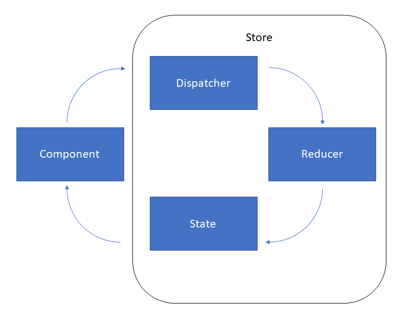

# Redux

## Qu"est-ce que c'est ?

C'est un moyen de gére son state comme avec l'API de contexte. D'ailleurs Redux utilise l'API de contexte. IL n'est pas seulement utilisable avec React, mais avec tout.  
Il existe cependant une version de rédux adaptée à React avec des fonctionalités supplémentaires et un environnement adapté.  

>  Les 2 site de la librairie étant similaire et attention à aller sur le site 'React-Redux'. Néanmoins, les informations fournies sur 'Redux' sont majoritairement réutilisables avec 'React'.  
Ça a beaucoup évoluer et quand on chehcher dans la documentation il n'est pas rare de tomber sur d'anciennes versions. C'est parfois gêant car elle était beaucoup plus compliquées autrefoix.  
Dans une recherche Google, il est indispensable de choisir via le bouton 'Outils', 'Moins d'un an' quelque soit la recherche sur 'React'n ; ça limite la quantité de documentions dépréciées.  
Exemple : un article de 2017 est presque entièrement déprecié.
---
Cependant, il a pour avantage d'être beaucoup plus simple qu'autrefois. Par exemple avec les hooks.

## Le shéma de Redux

Le store Contient les données et les méthodes pour changer les données.  
À côter, le composan qui est l'interface qui va affichr les données et / ou effectué des actions pour envoyer au store et demander le changement du state.  
1. Il envoi donc un **dispatche** 'expédier ce qu'il veut changer' au **reducer**;  
2. Le **reducer** change le state ;  
3. Il va apporter le nouveau state et composant.  
_C'est le cycle de Redux._

## Installer Redux

Deux éléments sont à installer ; 

1. L'outil **Redux** saisir `npm install redux` ;
2. 'React-redux' via la commande `react-redux`pour l'intégration optimale.

> NOTA  
Dans **Visual Studio Code**, taper `ctrl`+ `ù` pour ouvir un terminal.