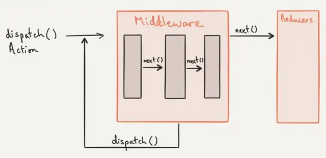

# **Middleware**

## Le _middleware_ est entre l'exécution d'une méthode _dispatch_ est l'envoi de ce dernier. Il se déclenche quand quelque chose est envoyé.  

---

> Exemple :  
1. Quand un article est ajouté au panier,
2. ça appelle une méthode '_dispatch_',
3. puis trigger (déclenche) un middleware,
4. le middleware va lancer une action (modifier des données, modifier le dispatch, faire un appel asynchrone à une API, changer le rooting, et cætera),
5. puis rappel le dispatch.

---

> Pour l'utiliser    

Il faut importer `applyMiddleware` dans `store.js`
Et le placer dans la constante '_store_' en argument qui à lui-même un middleware à exécuter.
```jsx
const store = createStore(rootReducer, applyMiddleware(customMiddleware));
```
---

> En résumer  

Un middleware :
1. se déclenche dès qu'il y a un _dispatch_,
```jsx
    dispatch({
        type: "ADDCART",
        payload: cartData
    })
```
2. déclenche le poste de contrôle du middleware,
```jsx
applyMiddleware(customMiddleware)
```
3. exécute ce qui se trouve dans son corps de fonction,
```jsx
const customMiddleware = store => next => action => {
    console.log(store); // donne le state avant que le dispatch ne soit effectué
    console.log(next); //  est une fonction appelée quand le travail est fini dans le middleware
    console.log(action); // c'est l'action du dispatch

    const actionModif ={
        type: "ADDCART",
        payload: 789
    }
    next(actionModif) // donne une nouvelle action
}
```
4. puis continue le chemin jusqu'au _reducer_, donc jusqu'à la modification du 'state' dans le store.
```jsx
    next(actionModif) // donne une nouvelle action
```
