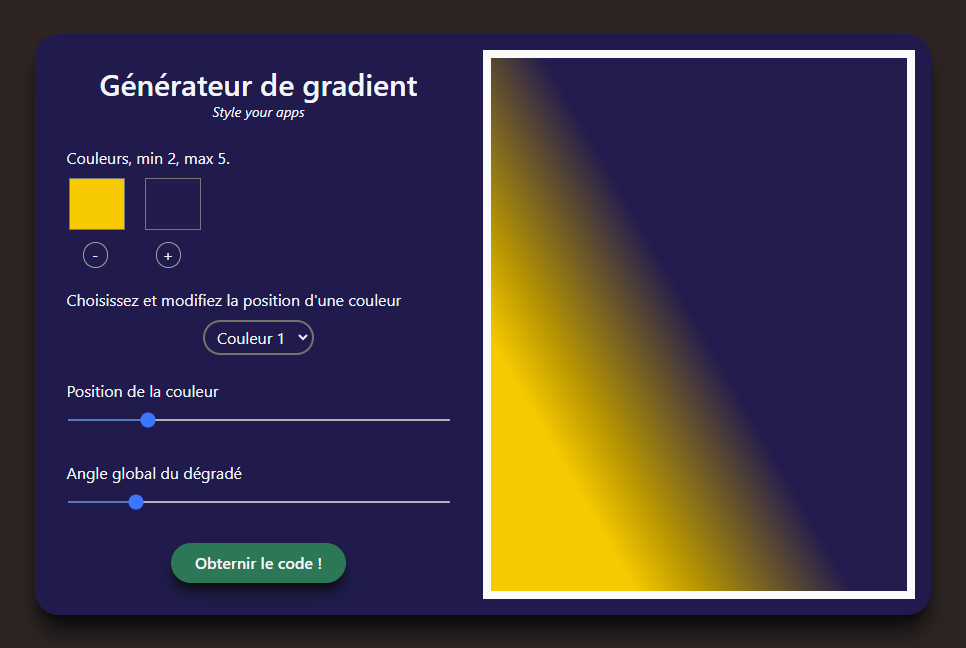
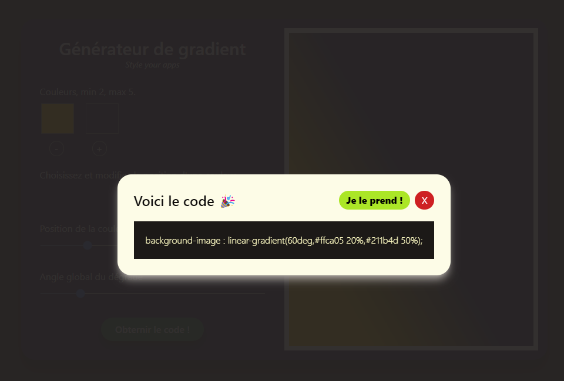

# **Gradient maker** 

Ce générateur de gradient permet
* D'obtenir le code d'un gradient allant de 2 à 5 couleurs ;
* D'ajouter ou retire une couleur ;
* De changer la posiion de l'une d'elles ;
* De changer l'angle ;
* De voir le code dans une fenêtre modale ;
* De le copier via un bouton.

  
